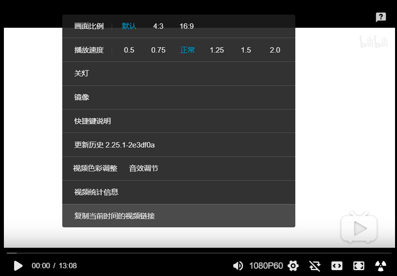

增强哔哩哔哩播放器
======

[](https://github.com/fython/userscript-enhance-bilibili-player/blob/master/LICENSE)

## 介绍

这是一个用于增强哔哩哔哩网页播放器使用体验的 Tampermonkey 插件。

### 插件功能

目前哔哩哔哩播放器增强插件实现的功能如下：

- 按需隐藏原播放器菜单不常用的选项
- 复制当前播放位置的视频链接，可选 `?t=12h34m56s`（时分秒）或 `?t=1234`（秒数）不同的参数风格
- 以视频实际分辨率、不带弹幕，复制当前播放位置的视频截图
- 对当前播放内容进行录制
- 插件设置页面

### 使用场景

其一：在播放器点击鼠标右键打开菜单，即可复制当前播放位置的视频链接发给你的朋友，对方打开这个链接时会直接跳转到指定位置，和 YouTube 的使用体验相同。



## 安装

在使用之前请先确保你已经在浏览器安装了 [Tampermonkey/油猴](https://www.tampermonkey.net/?ext=dhdg&locale=zh)，如果你无法通过官方的 Chrome Store 渠道获取，请使用国内的搜索引擎搜索油猴的离线安装版。

然后在 [【GreasyFork: 397885-哔哩哔哩播放器增强】](https://greasyfork.org/zh-CN/scripts/397885-%E5%93%94%E5%93%A9%E5%93%94%E5%93%A9%E6%92%AD%E6%94%BE%E5%99%A8%E5%A2%9E%E5%BC%BA) 进行安装。

## 开发 & 编译

### 安装依赖

在获取源码到本地后，你需要保证开发环境已安装 Node.js 和 NPM。

然后在项目目录执行 `npm install` 安装编译所需要的依赖。

### 运行调试

执行 `npm run dev:userscript` 进行插件的测试版本编译，在已安装 Tampermonkey 插件的浏览器中打开 `http://127.0.0.1:10801/enhance-biliplayer.user.js` 即可安装当前编译的插件程序，每次热更新后都需要重新打开这个地址更新插件。

执行 `npm run dev:settings` 运行插件设置页面，默认是 `http://127.0.0.1:10802`。正式版 `production` 编译的插件不会连接到本地运行的设置，请配合上面的测试版本插件使用。

执行 `npm run build` 对脚本进行打包输出，编译结果将存放在项目目录的 `dist` 中。

### 贡献代码

欢迎提出 Issues 或 Pull Request，提交分支请选择 `dev` 分支，`master` 为正式发布分支，一旦提交到 `master` 就会执行 GitHub Actions 发布新的正式版本到 `gh-pages` 和 GreasyFork 仓库中。

项目结构如下：

```
| .github          : 存放 Markdown 引用的媒体资源和 GitHub Actions 定义
| build            : Webpack 编译设置
| common           : 【插件本体与设置页面的共享源码（常量、存储）】
| pages            : 外部页面源码
| |- settings      : 【插件设置页面源码】
|    |- assets     : 设置页面样式、资源
|    |- components : 页面组件
|    |- plugins    : Vue 插件
|    |- App.vue    : 设置主页面 Vue 源码
|    |- index.js   : 主入口
|    |- index.tpl  : 页面模版
|
| src              : 【插件本体源码】
| |- lang          : 文本翻译
| |- util          : 工具集
| |- constants.js  : 插件本体常量
| |- index.js      : 插件入口、实现的功能定义
| |- ui.js         : 插件界面定义
|
| .babelrc         : Babel 配置
| .eslintignore    : ESLint 忽略检查清单
| .eslintrc.js     : ESLint 配置
| package.json     : NPM 包定义
```

## License

```
MIT License

Copyright (c) 2020 Siubeng Fung (fython)

Permission is hereby granted, free of charge, to any person obtaining a copy
of this software and associated documentation files (the "Software"), to deal
in the Software without restriction, including without limitation the rights
to use, copy, modify, merge, publish, distribute, sublicense, and/or sell
copies of the Software, and to permit persons to whom the Software is
furnished to do so, subject to the following conditions:

The above copyright notice and this permission notice shall be included in all
copies or substantial portions of the Software.

THE SOFTWARE IS PROVIDED "AS IS", WITHOUT WARRANTY OF ANY KIND, EXPRESS OR
IMPLIED, INCLUDING BUT NOT LIMITED TO THE WARRANTIES OF MERCHANTABILITY,
FITNESS FOR A PARTICULAR PURPOSE AND NONINFRINGEMENT. IN NO EVENT SHALL THE
AUTHORS OR COPYRIGHT HOLDERS BE LIABLE FOR ANY CLAIM, DAMAGES OR OTHER
LIABILITY, WHETHER IN AN ACTION OF CONTRACT, TORT OR OTHERWISE, ARISING FROM,
OUT OF OR IN CONNECTION WITH THE SOFTWARE OR THE USE OR OTHER DEALINGS IN THE
SOFTWARE.
```
